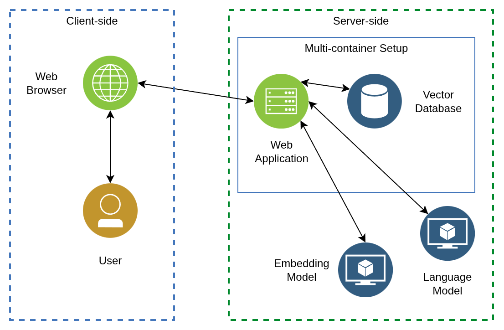

# breaking-bad-rag

RAG (Retrieval-Augmented Generation) implementation using FOSS technologies with Breaking Bad plots as the Knowledge Base.

## Requirements

- [Docker](https://www.docker.com/) 
- [Ollama](https://ollama.com/download)

## Setup

### Development

1. Install Docker with Docker Compose and Ollama.
2. Clone this repository.
3. In Ollama, make sure to pull an Embedding model and a Language model.
4. Make a copy of `config.env.example` and name it to `config.env`. Modify or set the configuration inside the said file.
5. Run `docker compose -f docker-compose.dev.yml up` to run this project.
6. Open a browser and visit `http://localhost:8000/`.

## License

Code released under the [MIT License](LICENSE).

## Credits

- [Wikipedia](https://www.wikipedia.org/)
- Authors and contributors of the [List of Breaking Bad episodes](https://en.wikipedia.org/wiki/List_of_Breaking_Bad_episodes),
including the episode specific ariticles on Wikipedia.
